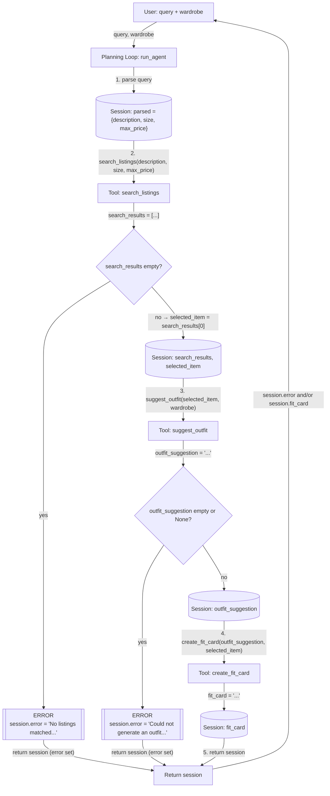

# FitFindr — planning.md

> Complete this document before writing any implementation code.
> Your spec and agent diagram are what you'll use to direct AI tools (Claude, Copilot, etc.) to generate your implementation — the more specific they are, the more useful the generated code will be.
> Your planning.md will be reviewed as part of your submission.
> Update it before starting any stretch features.

---

## Tools

List every tool your agent will use. For each tool, fill in all four fields.
You must have at least 3 tools. The three required tools are listed — add any additional tools below them.

### Tool 1: search_listings

**What it does:**
Searches the mock listings dataset for items whose text matches a free-text description, with optional size and max price filters, and returns the closest matches first.

**Input parameters:**
- `description` (str): Free-text keywords describing what the user wants, like `"vintage graphic tee"`. This is used to score each listing by how much its title, description, and style tags overlap with those keywords.
- `size` (str | None): A size to filter by, matched case-insensitively (so `"M"` matches `"S/M"`). If `None`, no size filter is applied.
- `max_price` (float | None): The most the user wants to spend, inclusive. If `None`, no price filter is applied.

**What it returns:**
A `list[dict]` of matching listings, sorted so the best match comes first, or an empty list if nothing matches. Each listing dict contains `id` (str), `title` (str), `description` (str), `category` (str, one of tops, bottoms, outerwear, shoes, or accessories), `style_tags` (list[str]), `size` (str), `condition` (str, one of excellent, good, or fair), `price` (float), `colors` (list[str]), `brand` (str or None), and `platform` (str, one of depop, thredUp, or poshmark).

**What happens if it fails or returns nothing:**
It never raises an exception. If the price or size filters rule out every listing, or nothing scores above zero on the keyword match, it just returns an empty list. When that happens, the planning loop notices the empty list, sets `session["error"]` to a message telling the user nothing matched and suggesting they loosen the price or size, and stops there. It does not go on to call `suggest_outfit` or `create_fit_card`.

---

### Tool 2: suggest_outfit

**What it does:**
Asks an LLM to put together one or two complete outfits pairing a newly found thrifted item with pieces the user already owns, or to give general styling advice if the user's wardrobe is empty.

**Input parameters:**
- `new_item` (dict): A listing dict, in the same format `search_listings` returns, for the item the user is considering buying.
- `wardrobe` (dict): A wardrobe dict with an `items` key holding a list of wardrobe item dicts (`id`, `name`, `category`, `colors`, `style_tags`, `notes`). That `items` list can be empty.

**What it returns:**
A non-empty string with the outfit suggestion(s) written in plain language. When the wardrobe has items, it calls out specific pieces by name alongside the new item. When the wardrobe is empty, it talks more generally about what kinds of items and what vibe would pair well.

**What happens if it fails or returns nothing:**
An empty wardrobe isn't treated as a failure. In that case, the tool just asks the LLM for general styling advice about `new_item` on its own and still hands back a non-empty string. The planning loop only treats it as a real failure if the return value comes back `None`, empty, or just whitespace. If that happens, it sets `session["error"]` to a message saying it couldn't put together an outfit and stops there, without calling `create_fit_card`.

---

### Tool 3: create_fit_card

**What it does:**
Asks an LLM to turn an outfit suggestion and a thrifted item's details into a short, casual caption you could actually post, like an Instagram or TikTok outfit-of-the-day caption.

**Input parameters:**
- `outfit` (str): The outfit suggestion string that came back from `suggest_outfit()`.
- `new_item` (dict): The listing dict for the thrifted item, used to pull the title, price, and platform into the caption.

**What it returns:**
A 2 to 4 sentence caption that mentions the item's name, price, and platform once each and describes the outfit's vibe in specific terms. It's generated with a higher LLM temperature so it reads a little differently each time.

**What happens if it fails or returns nothing:**
If `outfit` comes in empty, `None`, or just whitespace, the tool skips calling the LLM entirely and returns a plain error string instead, something like "Can't create a fit card without an outfit suggestion." It never raises an exception or returns an empty string. The planning loop just stores whatever string comes back in `session["fit_card"]`. Since `outfit` is already guaranteed to be non-empty by the time `suggest_outfit` has succeeded, this check is really a last line of defense and on its own doesn't set `session["error"]`.

---

### Additional Tools (if any)

None. FitFindr uses exactly the three required tools.

---

## Planning Loop

**How does your agent decide which tool to call next?**

The loop follows a fixed order (search, then suggest, then card) with two points where it can bail out early. It's not making an open-ended decision at each step, it's just checking whether the last tool call gave it enough to keep going. Here's how `run_agent(query, wardrobe)` works through it:

1. **Initialize.** Create `session = _new_session(query, wardrobe)`.
2. **Parse.** Pull `description`, `size`, and `max_price` out of `query` using regex and simple string splitting rather than an LLM call. The query formats are predictable enough for this (a price after "under $" or "$", an optional "size X" token), so a deterministic parser is easier to test and won't give different results from one run to the next. Store the result as `session["parsed"] = {"description": ..., "size": ..., "max_price": ...}`, defaulting `size` and `max_price` to `None` when they're not mentioned.
3. **Search.** Call `search_listings(**session["parsed"])` and store the result in `session["search_results"]`.
   - If that list comes back empty, set `session["error"]` to something like "No listings matched your search, try loosening the price or size," and return the session right away. `suggest_outfit` and `create_fit_card` never get called.
   - If there are results, take the top one as `session["selected_item"] = session["search_results"][0]` and move on.
4. **Suggest outfit.** Call `suggest_outfit(new_item=session["selected_item"], wardrobe=session["wardrobe"])` and store the result in `session["outfit_suggestion"]`.
   - If that comes back `None` or blank, set `session["error"]` to something like "Could not generate an outfit suggestion" and return early, skipping `create_fit_card`. This shouldn't normally happen since `suggest_outfit` is designed to always return something, even for an empty wardrobe, but it's a safety net.
   - Otherwise, move on to the last step.
5. **Create fit card.** Call `create_fit_card(outfit=session["outfit_suggestion"], new_item=session["selected_item"])` and store the result in `session["fit_card"]`.
6. **Done.** Return `session`. The loop only ever makes one pass through search, suggest, and card. It doesn't retry a tool or loop back to an earlier step. The caller knows it's finished as soon as `run_agent` returns: check `session["error"]` first, and if that's `None`, `session["fit_card"]` has the final result.

---

## State Management

**How does information from one tool get passed to the next?**

Everything for a single user interaction lives in one plain dict, the session, created by `_new_session(query, wardrobe)` at the start of `run_agent` and returned at the end. There's no separate database or global state. Each tool is a pure function that takes plain arguments and returns a plain value, and it's the planning loop's job to read the right fields out of the session, pass them into the next tool call, and write the result back in.

The fields tracked in the session are:

- `query` (str): the original user query, set once at the start and never changed. It's kept around mainly for logging and debugging, since it's not needed again once parsing is done.
- `parsed` (dict): the `description`, `size`, and `max_price` pulled out of `query`. This is written once, right after initialization, and its contents are unpacked directly into the call to `search_listings`.
- `search_results` (list[dict]): whatever `search_listings` returns. The loop checks this list's length to decide whether to continue or bail out with an error.
- `selected_item` (dict or None): the single listing the rest of the pipeline works with, set to `search_results[0]` once results come back. This is the field that actually gets handed to both `suggest_outfit` and `create_fit_card`, so the loop never has to re-derive it or re-run the search.
- `wardrobe` (dict): the wardrobe passed in by the caller, stored as-is. It's read once, when calling `suggest_outfit`, and never modified.
- `outfit_suggestion` (str or None): the string `suggest_outfit` returns, using `selected_item` and `wardrobe`. This becomes the `outfit` argument to `create_fit_card`.
- `fit_card` (str or None): the string `create_fit_card` returns, using `outfit_suggestion` and `selected_item`. This is the final result shown to the user.
- `error` (str or None): `None` unless a step fails, in which case it's set to a specific message and the loop returns immediately. Any code reading the session checks this field first, since a non-`None` error means the later fields (`selected_item` onward, depending on where it failed) were never filled in.

So state flows in one direction, forward through the pipeline: each tool only ever reads fields that an earlier step already wrote, and only ever writes the one or two fields that belong to it. Nothing is passed as a separate argument outside the session except at the very first call into `run_agent(query, wardrobe)`; after that, every tool call's inputs are pulled from the session, and every tool call's output is written straight back into it.

---

## Error Handling

For each tool, describe the specific failure mode you're handling and what the agent does in response.

| Tool | Failure mode | Agent response |
|------|-------------|----------------|
| search_listings | No results match the query | `search_listings` returns `[]`. The loop sets `session["error"]` to a specific message naming what was searched and why nothing came back, e.g. "No listings matched 'vintage band tee' under $30. Try raising your price limit, dropping the size filter, or using a broader description." It returns the session immediately with `selected_item`, `outfit_suggestion`, and `fit_card` left as `None`, instead of guessing or calling the other tools with nothing to work with. |
| suggest_outfit | Wardrobe is empty | This isn't treated as an error at all. `suggest_outfit` checks `wardrobe["items"]` up front, and if it's empty, it asks the LLM for general styling advice about the new item alone, e.g. what fabrics, colors, or silhouettes would pair well and what vibe it fits, instead of naming specific pieces the user doesn't have. That advice string flows into `create_fit_card` normally, and the loop keeps going. The user still gets a usable fit card, just one that suggests what to pair the item with rather than pointing at exact pieces they own. |
| create_fit_card | Outfit input is missing or incomplete | `create_fit_card` checks `outfit` for empty or whitespace-only input before calling the LLM. If it's missing, it returns a plain string like "Can't create a fit card, no outfit suggestion was generated for this item," instead of raising or returning `""`. The loop stores that string in `session["fit_card"]` and shows it to the user as the final output, rather than crashing or silently returning nothing. In the normal pipeline this shouldn't trigger, since the loop already stops earlier if `suggest_outfit` fails, so it mainly guards against `create_fit_card` being called directly with bad input. |

---

## Architecture

- **Nodes:** the user (who supplies the query and wardrobe), the planning loop (`run_agent`), the three tools, the session dict, and the two error terminals.
- **Arrows:** each arrow is labeled with either the function call and its arguments, or the specific session field being written.
- **Error branches:** if `search_results` comes back empty, or `outfit_suggestion` comes back empty/`None`, the loop sets `session.error` and jumps straight to `Return session`, skipping the remaining tools entirely. Both error paths rejoin the same return point as the success path, so the caller always gets a `session` dict back and only needs to check `session["error"]` to know which path was taken.

---

## AI Tool Plan

**Milestone 3 — Individual tool implementations:**

*search_listings:* I'll give Claude the Tool 1 block from planning.md (the inputs, the return value with its exact fields, and the failure mode) along with the `load_listings()` docstring from `utils/data_loader.py`, and ask it to implement the function in `tools.py`. Before trusting the output, I'll check that it actually filters by `size` and `max_price` before scoring, that the keyword scoring drops anything with a score of zero instead of just sorting everything, and that it returns `[]` on no matches rather than raising. Then I'll run it by hand against three queries: one that should return several results, one narrow enough to return exactly one, and one that should return none.

*suggest_outfit:* I'll give Claude the Tool 2 block from planning.md plus the wardrobe schema from `data/wardrobe_schema.json`, and ask it to implement the function using the Groq client already set up in `tools.py`. I'll check that it branches on `wardrobe["items"]` being empty before ever building a prompt, and that both branches return a plain non-empty string rather than raising. I'll test it once with `get_example_wardrobe()` and once with `get_empty_wardrobe()` and read both outputs to confirm they're coherent and actually mention the new item.

*create_fit_card:* I'll give Claude the Tool 3 block from planning.md and ask it to implement the function, again using the existing Groq client. I'll check that it guards against an empty or whitespace-only `outfit` string before calling the LLM at all, that the caption mentions the item's title, price, and platform exactly once each, and that the temperature is set noticeably higher than a default call. I'll run it twice on the same input to confirm the wording actually changes between calls, and once with an empty `outfit` string to confirm it returns the error string instead of raising.

**Milestone 4 — Planning loop and state management:**

I'll give Claude the Planning Loop section, the Architecture diagram, and the `_new_session()` dict from `agent.py`, and ask it to implement `run_agent()` in `agent.py` following those steps exactly, calling the already-tested versions of the three tools. Before trusting the output, I'll check it against the diagram step by step: that it parses the query before calling `search_listings`, that it checks `len(search_results) == 0` and returns early with `session["error"]` set instead of continuing, that it only calls `suggest_outfit` and `create_fit_card` when there's a `selected_item` to pass in, and that every field named in `_new_session()` actually gets written to somewhere in the function. Then I'll run the two example cases already sketched out in `agent.py`'s `__main__` block (a normal graphic-tee query and the impossible ballgown query) and confirm the happy path fills in `selected_item`, `outfit_suggestion`, and `fit_card` while the no-results path stops with `session["error"]` set and the later fields left as `None`.

---

## A Complete Interaction (Step by Step)

Write out what a full user interaction looks like from start to finish — tool call by tool call. Use a specific example query.

**Example user query:** "I'm looking for a vintage graphic tee under $30. I mostly wear baggy jeans and chunky sneakers. What's out there and how would I style it?"

**Step 1: Parse the query.**
`run_agent` parses the query before calling any tool. It pulls out `description = "vintage graphic tee"` and `max_price = 30.0` from "under $30", and finds no size mentioned, so `size = None`. This is stored as `session["parsed"] = {"description": "vintage graphic tee", "size": None, "max_price": 30.0}`.

**Step 2: Call search_listings.**
The loop calls `search_listings(description="vintage graphic tee", size=None, max_price=30.0)`. Against the mock dataset, this pulls back every item under $30 whose title, description, or style tags overlap with "vintage", "graphic", or "tee", ranked by how many of those keywords each one hits. Several listings hit all three and tie at the top score, including `lst_002` ("Y2K Baby Tee — Butterfly Print," $18 on depop, tagged `y2k`, `vintage`, `graphic tee`, `cottagecore`), `lst_006` ("Graphic Tee — 2003 Tour Bootleg Style," $24), and `lst_033` ("Vintage Band Tee — Faded Grey," $19). The scoring function doesn't tie-break beyond raw keyword count, and Python's sort is stable, so ties fall back to the order they appear in `listings.json`. That puts `lst_002` first. `session["search_results"]` gets the full ranked list, and `session["selected_item"]` is set to `lst_002`. Since the list isn't empty, the loop moves on instead of stopping with an error.

**Step 3: Call suggest_outfit.**
The loop calls `suggest_outfit(new_item=lst_002, wardrobe=session["wardrobe"])`, where `wardrobe` is the user's example wardrobe. Since the user mentioned baggy jeans and chunky sneakers, and the wardrobe already contains `w_001` ("Baggy straight-leg jeans, dark wash") and `w_007` ("Chunky white sneakers"), the LLM builds an outfit around exactly those pieces, something like pairing the baby tee with the baggy jeans and chunky sneakers for a Y2K streetwear look, maybe layering the vintage black denim jacket (`w_006`) on top. That string is stored in `session["outfit_suggestion"]`. Since it's non-empty, the loop continues.

**Step 4: Call create_fit_card.**
The loop calls `create_fit_card(outfit=session["outfit_suggestion"], new_item=lst_002)`. It builds a short caption mentioning the tee by name, its $18 price, and depop once each, describing the fit in specific terms (baggy jeans, chunky sneakers, denim jacket), and stores the result in `session["fit_card"]`.

**Step 5: Return the session.**
`session["error"]` is still `None`, so `run_agent` returns the completed session with `selected_item`, `outfit_suggestion`, and `fit_card` all filled in.

**Final output to user:**
The user sees the generated fit card, something like: *"Just snagged this Y2K Baby Tee — Butterfly Print for $18 on depop and it's giving exactly your vibe. Throw it on with your baggy dark-wash jeans and chunky white sneakers, maybe layer the black denim jacket over it if it's chilly, for an easy Y2K streetwear fit."* If step 2 had come back empty instead (say the user asked for a designer ballgown under $5), the user would see the error message from `session["error"]` instead, telling them nothing matched and suggesting they loosen the price or description, with no outfit or fit card generated.
